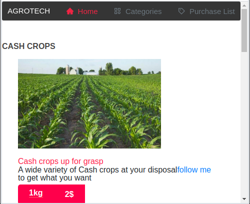
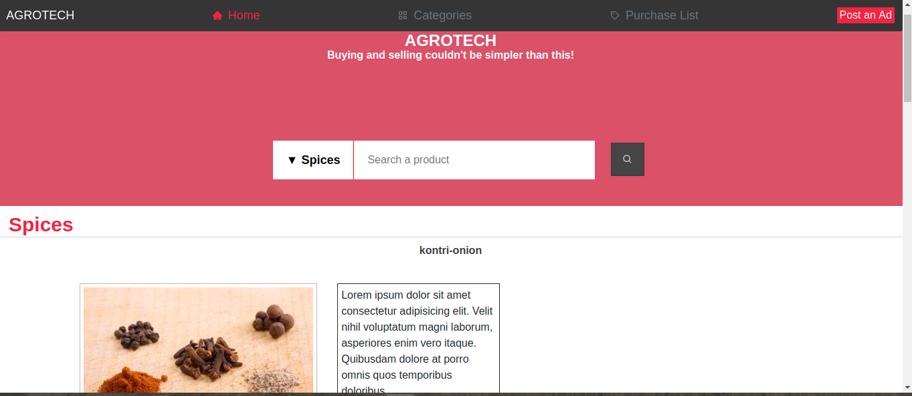

# Microverse HTML/CSS capstone project.

# online-shop

We build an online shop for agricultural products, from cash crops, food crops, fruits, and more where you can shop online, get what you need. Free and fast delivery.

**Mobile view screenShot**

**Tablet view screenShot &  Laptop view screenShot**

## Features of The Online Shop  Websites:

- Navigation Bar
- Main section
- Footer

## Built With

- 
- 
- Bootstrap

## Getting Started

To get a local copy of this repository up and running follow these simple steps:

### Prerequisites

- A PC or device with internet connection with the ability to use command line  or terminal.

### Setup

- Open the command line  or terminal

### Install

- Go to your preferred directory
- Run git clone git@github.com:ArreyTabe/online-shop.git command

### Usage

- Open index.html file in any modern browser

## Live Demo

[Live Demo Link](https://raw.githack.com/ArreyTabe/online-shop/shop-features/index.html)

**See the page via the link above**

## Project presentation
[project presentation Link](https://youtu.be/i9HHoU6F_vg)

👤 **Arrey Tabe**

- Github: [ArreyTabe](https://github.com/ArreyTabe)
- Twitter: [@tabe_arrey](https://twitter.com/tabe_arrey)
- LinkedIn: [Arrey Affuembey](https://www.linkedin.com/in/arrey-affuembey-80a8b11a8/)

## Show your support

Give a ⭐️ if you like this project!

## 📝 License

This project is [MIT](https://choosealicense.com/licenses/mit/) licensed.
